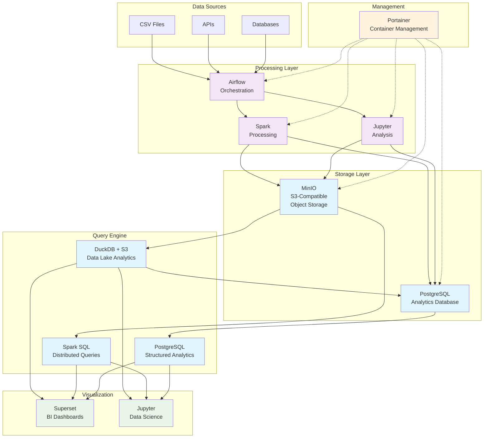

# Lakehouse Lab 🏠📊

[](https://github.com/karstom/lakehouse-lab/releases)
[](https://docs.docker.com/compose/)
[](https://opensource.org/licenses/MIT)
[](CONTRIBUTING.md)

> **Complete Open Source Data Analytics Stack in 15 Minutes**

A production-ready lakehouse environment using modern open source tools. Perfect for learning, development, and small-to-medium production workloads. **Now with DuckDB + S3 for powerful multi-file analytics!**

## ⚡ Ultra-Quick Start

**Get your complete data analytics stack running with a single command:**

```bash
curl -sSL https://raw.githubusercontent.com/karstom/lakehouse-lab/main/install.sh | bash
```

**For Windows WSL or macOS users** (if you get piping issues):
```bash
curl -sSL https://raw.githubusercontent.com/karstom/lakehouse-lab/main/install.sh -o /tmp/install.sh && bash /tmp/install.sh
```

**⚠️ WSL users:** If Docker is installed during setup, restart your terminal and re-run the installer to complete the process.

That's it! ☕ Grab a coffee while it sets up your entire lakehouse environment.

**For high-performance servers (64GB+ RAM):**
```bash
curl -sSL https://raw.githubusercontent.com/karstom/lakehouse-lab/main/install.sh | bash -s -- --fat-server
```

**Alternative setup with Git:**
```bash
git clone https://github.com/karstom/lakehouse-lab.git
cd lakehouse-lab
./install.sh
```

> ⚠️ **Important**: Always use `./install.sh` for new installations. Running `docker compose up -d` directly will fail because it requires secure credentials and initialization that only the installer provides.

Wait 3-5 minutes for initialization, then run `./scripts/show-credentials.sh` to see all service URLs with your detected IP address.

## ⚠️ Installation vs Service Management

### For New Installations (First Time)
**Always use the installer:**
```bash
./install.sh
```
The installer handles:
- ✅ Secure credential generation
- ✅ Script permissions and dependencies  
- ✅ Resource optimization for your system
- ✅ Complete environment initialization
- ✅ Service startup and health verification

### For Existing Installations (Day-to-Day)
**Use Docker Compose commands:**
```bash
docker compose up -d        # Start services
docker compose down         # Stop services  
docker compose restart     # Restart services
docker compose logs -f     # View logs
```

> 💡 **Key Point**: `docker compose up -d` only works **after** running the installer at least once. The installer creates the required `.env` file with secure credentials that Docker Compose needs.

## 🔄 Upgrading Existing Installation

**Already have Lakehouse Lab installed?** The installer automatically detects existing installations and offers smart upgrade options:

```bash
# Run the same installation command - it will detect and offer options
curl -sSL https://raw.githubusercontent.com/karstom/lakehouse-lab/main/install.sh | bash
```

You'll get user-friendly options:
- **Upgrade** - Updates to latest version while preserving your data and settings
- **Replace** - Fresh installation with clean slate (removes all data)
- **Cancel** - Exit without changes

**Or use direct flags:**
```bash
# Upgrade preserving data
curl -sSL https://raw.githubusercontent.com/karstom/lakehouse-lab/main/install.sh | bash -s -- --upgrade

# Fresh installation (clean slate)
curl -sSL https://raw.githubusercontent.com/karstom/lakehouse-lab/main/install.sh | bash -s -- --replace
```

## 🎯 What You Get

| Service | Purpose | URL | Credentials |
|---------|---------|-----|-------------|
| **Portainer** | Container Management | Auto-detected IP:9060 | Create admin user |
| **Superset** | BI & Visualization | Auto-detected IP:9030 | 🔐 Generated securely |
| **JupyterLab** | Data Science Notebooks | Auto-detected IP:9040 | 🔐 Generated securely |
| **Airflow** | Workflow Orchestration | Auto-detected IP:9020 | 🔐 Generated securely |
| **MinIO Console** | Object Storage | Auto-detected IP:9001 | 🔐 Generated securely |
| **Spark Master** | Distributed Computing | Auto-detected IP:8080 | N/A |
| **Homer** | Service Links (Optional) | Auto-detected IP:9061 | N/A |
| **PostgreSQL** | Analytics Database | Auto-detected IP:5432 | 🔐 Generated securely |

📋 **Get exact URLs**: Run `./scripts/show-credentials.sh` to see service URLs with your detected IP address.

## 🔒 Secure Credential Management

**No more default passwords!** Lakehouse Lab now generates unique, secure credentials for each installation:

### View Your Credentials
```bash
./scripts/show-credentials.sh
```

### Credential Features
- 🎯 **Memorable Passphrases**: Easy-to-type formats like `swift-river-bright-847`
- 🔐 **Strong Database Passwords**: Cryptographically secure for backend services
- 🔄 **Unique Per Installation**: Every deployment gets different credentials
- 🛡️ **Environment Variables**: Secure configuration without hardcoded secrets

### Credential Management Scripts
```bash
# Generate new credentials (done automatically during installation)
./scripts/generate-credentials.sh

# View current credentials in a friendly format
./scripts/show-credentials.sh

# Rotate all credentials (generates new ones)
./scripts/rotate-credentials.sh
```

**⚠️ Important**: Your credentials are stored in the `.env` file. Back it up securely and never commit it to version control.

## 📖 Documentation

- [🚀 **Quick Start**](QUICKSTART.md) - Get running in 15 minutes
- [📚 **Installation Guide**](INSTALLATION.md) - Complete installation options
- [☁️ **Cloud Deployment**](CLOUD_DEPLOYMENT.md) - AWS, GCP, Azure deployment guides
- [🤝 **Contributing**](CONTRIBUTING.md) - How to contribute
- [📋 **Changelog**](CHANGELOG.md) - Version history

## 🏗️ Architecture



### **Component Overview**

| **Layer** | **Components** | **Purpose** |
|-----------|----------------|-------------|
| **Data Sources** | CSV Files, APIs, Databases | Raw data ingestion from various sources |
| **Processing** | Apache Airflow, Apache Spark, Jupyter | ETL workflows, distributed processing, analysis |
| **Storage** | MinIO (S3-compatible), PostgreSQL | Object storage + analytics database |
| **Query Engine** | DuckDB + S3, Spark SQL, PostgreSQL | Data lake analytics + structured queries |
| **Visualization** | Apache Superset, Jupyter | BI dashboards and interactive analysis |
| **Management** | Portainer, Docker Compose | Container orchestration and monitoring |

### **Data Flow**

1. **Ingest** → Upload data files to MinIO or connect external sources
2. **Process** → Transform data using Spark jobs orchestrated by Airflow  
3. **Store** → Save processed data to MinIO (data lake) and PostgreSQL (analytics warehouse)
4. **Analyze** → Query data with DuckDB (data lake), PostgreSQL (structured), or Spark SQL (distributed)
5. **Visualize** → Create dashboards in Superset or notebooks in Jupyter from both data sources
6. **Monitor** → Manage and monitor all services through Portainer

**Dual Analytics Approach:**
- **Data Lake (DuckDB + MinIO)**: Direct file queries, multi-format support, schema-on-read
- **Data Warehouse (PostgreSQL)**: Structured analytics, ACID transactions, optimized performance

### **Key Architectural Benefits**

- **🚀 S3-Native Analytics**: Query files directly without data movement
- **🏗️ Dual Analytics**: Data lake (DuckDB) + warehouse (PostgreSQL) for different use cases
- **📊 Multi-Format Support**: CSV, Parquet, JSON, and more
- **🔄 Scalable Processing**: Spark scales from single machine to cluster
- **🎯 Modern Lakehouse**: Combines data lake flexibility with warehouse performance
- **🐳 Container-Based**: Consistent deployment across environments
- **📈 Production-Ready**: Health checks, monitoring, and orchestration included

## 🎛️ Configuration Options

### Standard Setup (Default)
Perfect for laptops, development machines, and small servers:
- **Memory**: ~16GB total allocation
- **CPU**: 4-8 cores recommended
- **Storage**: 50GB+ recommended

```bash
# Use default settings
docker compose up -d
```

### Fat Server Setup
Optimized for powerful hardware (32+ cores, 64GB+ RAM):
- **Memory**: ~100GB+ total allocation  
- **CPU**: 16+ cores utilized
- **Storage**: 500GB+ recommended

```bash
# Copy fat-server environment config
cp .env.fat-server .env
docker compose up -d
```

### Custom Configuration
```bash
# Copy and edit default settings
cp .env.default .env
# Edit .env with your preferred settings
docker compose up -d
```

### 🧊 Apache Iceberg Support (Advanced Analytics)
For advanced lakehouse analytics with time travel, schema evolution, and ACID transactions:

```bash
# Install with Iceberg support
./install.sh --iceberg

# Or manually start with Iceberg overlay
docker compose -f docker-compose.yml -f docker-compose.iceberg.yml up -d
```

**Iceberg Features:**
- ✅ **Time Travel**: Query data as it existed at any point in time
- ✅ **Schema Evolution**: Add, drop, rename columns without breaking existing queries  
- ✅ **Partition Evolution**: Change partitioning schemes without data migration
- ✅ **ACID Transactions**: Full consistency for concurrent read/write operations
- ✅ **Rollback & Branching**: Easily revert changes or create data branches

**Use Cases:** Perfect for data warehousing, regulatory compliance, and production analytics where data lineage and consistency are critical.

### Remote Server Deployment 🌐

When deploying on a remote server, the system automatically detects your server's IP address. For best results, you can explicitly set the HOST_IP:

**Automatic IP Detection (Recommended):**
```bash
# The system will automatically detect your server's public IP
docker compose up -d
./scripts/show-credentials.sh  # Shows URLs with detected IP
```

**Manual IP Configuration:**
```bash
# Set your server's public/accessible IP address
export HOST_IP=192.168.1.100  # Replace with your server's IP
docker compose up -d

# Or add to .env file:
echo "HOST_IP=192.168.1.100" >> .env
```

**Examples:**
- **Local machine**: `HOST_IP=localhost` (auto-detected)
- **Home server**: `HOST_IP=192.168.1.100` 
- **Cloud instance**: `HOST_IP=203.0.113.45`
- **Corporate network**: `HOST_IP=10.0.1.50`

**Important Notes:**
- 🔥 **Firewall**: Ensure ports 8080, 9001, 9020, 9030, 9040, 9060, 9061 are accessible
- 🔒 **Security**: Consider using a reverse proxy (nginx/traefik) for production
- 📋 **Access**: Use `./scripts/show-credentials.sh` to see service URLs with detected IP
- 🔄 **Homer Update**: If Homer dashboard shows old IPs, restart: `docker compose restart lakehouse-init`

## 📚 Getting Started Guide

### 1. **First Steps**
After startup, run `./scripts/show-credentials.sh` to see all service URLs and credentials, then visit Portainer for container monitoring.

### 2. **Load Sample Data**
Sample datasets and notebooks are automatically created:
- Check `/notebooks/` for Jupyter examples
- MinIO contains sample CSV files in `lakehouse/raw-data/`

### 3. **Query Data with DuckDB + S3 (Persistent Setup)**
**In Superset** - Get your service URL from `./scripts/show-credentials.sh`:

**Step 1: One-time S3 configuration (creates persistent secret):**
```sql
-- 🔐 Get your MinIO password: Run './scripts/show-credentials.sh'
CREATE PERSISTENT SECRET minio_secret (
    TYPE S3,
    KEY_ID 'admin',
    SECRET 'YOUR_MINIO_PASSWORD',  -- Replace with your actual password
    ENDPOINT 'minio:9000',
    USE_SSL false,
    URL_STYLE 'path',
    SCOPE 's3://lakehouse'
);
```

**Step 2: Query data (no setup needed after Step 1):**
```sql
-- Query sample data - works immediately
SELECT * FROM read_csv_auto('s3://lakehouse/raw-data/sample_orders.csv') LIMIT 10;

-- Multi-file analytics
SELECT 
    product_category,
    COUNT(*) as orders,
    SUM(total_amount) as revenue
FROM read_csv_auto('s3://lakehouse/raw-data/sample_orders.csv')
GROUP BY product_category
ORDER BY revenue DESC;

-- Multi-file queries across all CSVs
SELECT COUNT(*) as total_records 
FROM read_csv_auto('s3://lakehouse/raw-data/*.csv', union_by_name=true);
```

🎉 **The persistent secret survives sessions, logins, and container restarts!**

### 4. **Create Your First Pipeline**
**In JupyterLab** - Get your service URL from `./scripts/show-credentials.sh`:

**DuckDB Analytics:**
```python
import duckdb

# Connect to DuckDB (persistent secret already configured)
conn = duckdb.connect("/app/superset_home/lakehouse.duckdb")

# Query your data lake directly (no setup needed if secret exists)
result = conn.execute("""
    SELECT COUNT(*) as total_records 
    FROM read_csv_auto('s3://lakehouse/raw-data/*.csv', union_by_name=true)
""").fetchone()
print(f"Total records: {result[0]}")

# Advanced analytics
analytics = conn.execute("""
    SELECT 
        product_category,
        COUNT(*) as orders,
        SUM(total_amount) as revenue,
        AVG(total_amount) as avg_order_value
    FROM read_csv_auto('s3://lakehouse/raw-data/sample_orders.csv')
    GROUP BY product_category
    ORDER BY revenue DESC
""").fetchall()

for row in analytics:
    print(f"Category: {row[0]}, Orders: {row[1]}, Revenue: ${row[2]:.2f}")
```

**PostgreSQL Analytics:**
```python
import psycopg2
import pandas as pd

# Connect to PostgreSQL analytics database  
# Get password from: ./scripts/show-credentials.sh
conn = psycopg2.connect(
    host="postgres", 
    database="lakehouse",
    user="postgres", 
    password="YOUR_POSTGRES_PASSWORD"
)

# Run analytical queries
df = pd.read_sql("""
    SELECT 
        order_date,
        SUM(total_revenue) as daily_revenue,
        COUNT(*) as daily_orders
    FROM analytics.order_facts 
    WHERE order_date >= CURRENT_DATE - INTERVAL '30 days'
    GROUP BY order_date 
    ORDER BY order_date
""", conn)

print(df.head())
```

### 5. **Build Dashboards**
1. **Get Superset URL**: Run `./scripts/show-credentials.sh` to see your service URLs and login credentials
2. **Choose your database connection:**
   - **"DuckDB-S3"** - For data lake queries with persistent S3 access
   - **"PostgreSQL Analytics"** - For structured analytics and real-time dashboards  
3. **Create charts** with simple queries:
   - **DuckDB**: `SELECT * FROM read_csv_auto('s3://lakehouse/raw-data/sample_orders.csv')`
   - **PostgreSQL**: `SELECT * FROM analytics.order_facts WHERE order_date >= CURRENT_DATE - 7`
4. **Advanced features**: Both connections support CREATE, INSERT, UPDATE, DELETE operations
5. See the [Superset Database Setup Guide](SUPERSET_DATABASE_SETUP.md) for detailed configuration

### 6. **Orchestrate with Airflow**
1. **Get Airflow URL**: Run `./scripts/show-credentials.sh` to see your service URLs and login credentials
2. **Available DAGs:**
   - **`sample_duckdb_pipeline`** - DuckDB ETL pipeline with S3 data processing
   - **`postgres_analytics_etl`** - ETL pipeline from DuckDB to PostgreSQL analytics
   - **`postgres_streaming_analytics`** - Real-time data processing with anomaly detection
3. **Getting started:** Enable and trigger the `sample_duckdb_pipeline` DAG to see DuckDB in action

## 🗂️ Project Structure

```
lakehouse-lab/
├── docker-compose.yml           # Main stack definition
├── init-all-in-one-modular.sh  # Modular initialization script
├── scripts/                    # Initialization modules
├── templates/                  # Configuration templates
├── .env.default                # Default configuration
├── .env.fat-server             # High-resource configuration
├── README.md                   # This file
├── QUICKSTART.md               # Step-by-step guide
└── lakehouse-data/             # Data directory (created on startup)
    ├── airflow/
    │   ├── dags/               # Airflow workflows
    │   └── logs/               # Execution logs
    ├── notebooks/              # Jupyter notebooks with examples
    ├── minio/                  # Object storage data
    ├── postgres/               # Metadata database
    ├── spark/jobs/             # Spark job files
    └── homer/assets/           # Dashboard configuration
```

## 🔧 Advanced Usage

### Multi-File Analytics with DuckDB
```sql
-- Query all CSV files in a directory (after persistent secret setup)
SELECT * FROM read_csv_auto('s3://lakehouse/raw-data/*.csv', union_by_name=true);

-- Cross-format queries  
SELECT * FROM read_parquet('s3://lakehouse/warehouse/*.parquet')
UNION ALL
SELECT * FROM read_csv_auto('s3://lakehouse/raw-data/*.csv');

-- Partitioned data analysis
SELECT * FROM read_csv_auto('s3://lakehouse/data/year=2024/month=*/day=*/*.csv');

-- Advanced analytics with window functions
SELECT 
    product_category,
    order_date,
    total_amount,
    AVG(total_amount) OVER (
        PARTITION BY product_category 
        ORDER BY order_date 
        ROWS BETWEEN 6 PRECEDING AND CURRENT ROW
    ) as moving_avg_7day
FROM read_csv_auto('s3://lakehouse/raw-data/sample_orders.csv')
ORDER BY product_category, order_date;
```

### Adding New Data Sources
1. **CSV Files**: Upload to MinIO via console or API
2. **Database Connections**: Configure in Trino catalogs (if enabled)
3. **APIs**: Create Airflow DAGs for ingestion

### Scaling Up
1. **More Spark Workers**: Increase `SPARK_WORKER_INSTANCES` in `.env`
2. **Database Performance**: Tune Postgres settings for your workload
3. **Memory Allocation**: Adjust service limits in `.env`

### Development Workflow
1. **Develop**: Use JupyterLab for interactive development
2. **Pipeline**: Convert notebooks to Airflow DAGs
3. **Monitor**: Check execution in Airflow UI and Portainer
4. **Visualize**: Create dashboards in Superset

## 🐛 Troubleshooting

### Installation Issues

**Problem: "lakehouse-init" service fails with exit 2**
```bash
# Solution: Use the upgraded installer (automatically fixes this)
curl -sSL https://raw.githubusercontent.com/karstom/lakehouse-lab/main/install.sh | bash -s -- --replace
```

**Problem: Airflow database not initialized**
```bash
# Check if Airflow database tables exist
docker exec lakehouse-lab-postgres-1 psql -U postgres -d airflow -c "SELECT COUNT(*) FROM information_schema.tables WHERE table_schema='public';"

# If no tables, manually run initialization
docker-compose run --rm airflow-init
```

**Problem: Previous installation blocking new install**
```bash
# The installer now automatically detects and offers upgrade options, or:
curl -sSL https://raw.githubusercontent.com/karstom/lakehouse-lab/main/install.sh | bash -s -- --replace
```

### Services Won't Start
```bash
# Check service status
docker compose ps

# View logs for specific service
docker compose logs airflow-webserver
docker compose logs lakehouse-init

# Restart specific service
docker compose restart superset

# Full restart of all services
docker compose restart
```

### DuckDB S3 Connection Issues
```sql
-- Check if persistent secret exists
SELECT * FROM duckdb_secrets();

-- If no secret, create one (get password from ./scripts/show-credentials.sh)
CREATE PERSISTENT SECRET minio_secret (
    TYPE S3,
    KEY_ID 'admin',
    SECRET 'YOUR_MINIO_PASSWORD',
    ENDPOINT 'minio:9000',
    USE_SSL false,
    URL_STYLE 'path',
    SCOPE 's3://lakehouse'
);

-- Test connectivity
SELECT COUNT(*) FROM read_csv_auto('s3://lakehouse/raw-data/sample_orders.csv');
```

### Memory Issues
```bash
# Check memory usage
docker stats --no-stream

# Reduce memory limits in .env file
SUPERSET_MEMORY_LIMIT=2G
SPARK_WORKER_MEMORY_LIMIT=4G
```

### Port Conflicts
Change port mappings in docker-compose.yml:
```yaml
ports:
  - "9999:8080"  # Change 9010 to 9999
```

### Data Access Issues
```bash
# Test MinIO access (get URL from ./scripts/show-credentials.sh)
curl http://YOUR_IP:9001

# Check file permissions
ls -la lakehouse-data/

# Test PostgreSQL connection
docker exec lakehouse-lab-postgres-1 psql -U postgres -d lakehouse -c "SELECT version();"

# Reset all data (WARNING: Destroys everything)
docker compose down -v
rm -rf lakehouse-data/
docker compose up -d
```

## 🤝 Contributing

1. Fork the repository
2. Create a feature branch
3. Test with both standard and fat-server configs
4. Submit a pull request

## 📄 License

MIT License - see LICENSE file for details.

## 🙏 Acknowledgments

Built with these amazing open source projects:
- [DuckDB](https://duckdb.org/) - Fast analytical database with S3 support
- [PostgreSQL](https://www.postgresql.org/) - Advanced open source relational database
- [Apache Spark](https://spark.apache.org/) - Unified analytics engine
- [Apache Airflow](https://airflow.apache.org/) - Workflow orchestration
- [Apache Superset](https://superset.apache.org/) - Modern BI platform
- [MinIO](https://min.io/) - High-performance S3-compatible storage
- [Portainer](https://www.portainer.io/) - Container management platform
- [Homer](https://github.com/bastienwirtz/homer) - Static service dashboard

## 🌟 Key Features

- ✅ **15-minute setup** - Complete lakehouse in minutes
- ✅ **S3-native analytics** - Query files directly with DuckDB
- ✅ **Multi-file processing** - Wildcard queries across datasets
- ✅ **Production patterns** - Learn real-world data engineering
- ✅ **Container monitoring** - Full observability with Portainer
- ✅ **Scalable architecture** - From laptop to enterprise server
- ✅ **Educational focus** - Perfect for learning modern data stack

---

**Happy Data Engineering!** 🚀

For questions and support, please open an issue on GitHub.
