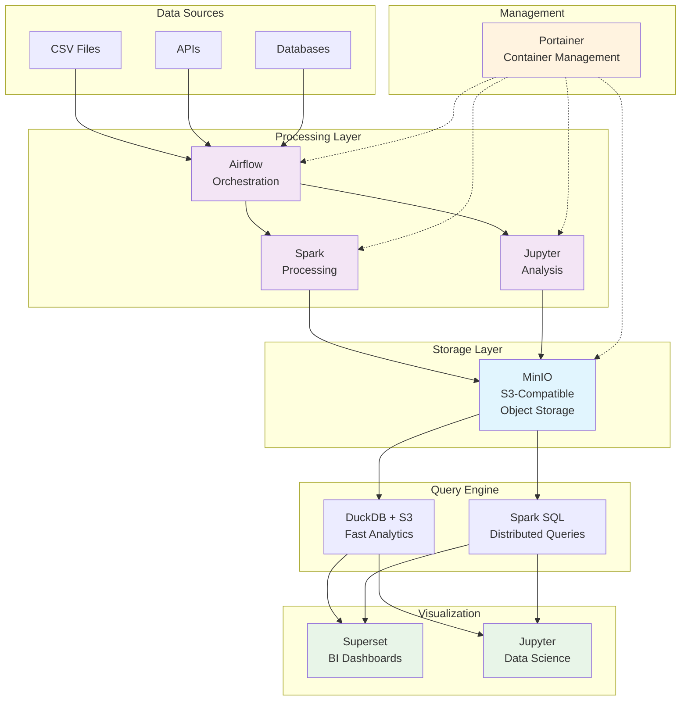

# Lakehouse Lab 🏠📊

[](https://github.com/karstom/lakehouse-lab/releases)
[](https://docs.docker.com/compose/)
[](https://opensource.org/licenses/MIT)
[](CONTRIBUTING.md)

> **Complete Open Source Data Analytics Stack in 15 Minutes**

A production-ready lakehouse environment using modern open source tools. Perfect for learning, development, and small-to-medium production workloads. **Now with DuckDB + S3 for powerful multi-file analytics!**

## ⚡ Ultra-Quick Start

**Get your complete data analytics stack running with a single command:**

```bash
curl -sSL https://raw.githubusercontent.com/karstom/lakehouse-lab/main/install.sh | bash
```

**For Windows WSL or macOS users** (if you get piping issues):
```bash
curl -sSL https://raw.githubusercontent.com/karstom/lakehouse-lab/main/install.sh -o /tmp/install.sh && bash /tmp/install.sh
```

That's it! ☕ Grab a coffee while it sets up your entire lakehouse environment.

**For high-performance servers (64GB+ RAM):**
```bash
curl -sSL https://raw.githubusercontent.com/karstom/lakehouse-lab/main/install.sh | bash -s -- --fat-server
```

**Alternative traditional setup:**
```bash
git clone https://github.com/karstom/lakehouse-lab.git
cd lakehouse-lab
docker compose up -d
```

Wait 3-5 minutes for initialization, then visit: **http://localhost:9060** (Portainer)

## 🔄 Upgrading Existing Installation

**Already have Lakehouse Lab installed?** The installer automatically detects existing installations and offers smart upgrade options:

```bash
# Run the same installation command - it will detect and offer options
curl -sSL https://raw.githubusercontent.com/karstom/lakehouse-lab/main/install.sh | bash
```

You'll get user-friendly options:
- **Upgrade** - Updates to latest version while preserving your data and settings
- **Replace** - Fresh installation with clean slate (removes all data)
- **Cancel** - Exit without changes

**Or use direct flags:**
```bash
# Upgrade preserving data
curl -sSL https://raw.githubusercontent.com/karstom/lakehouse-lab/main/install.sh | bash -s -- --upgrade

# Fresh installation (clean slate)
curl -sSL https://raw.githubusercontent.com/karstom/lakehouse-lab/main/install.sh | bash -s -- --replace
```

## 🎯 What You Get

| Service | Purpose | URL | Credentials |
|---------|---------|-----|-------------|
| **Portainer** | Container Management | http://localhost:9060 | Create admin user |
| **Superset** | BI & Visualization | http://localhost:9030 | admin/admin |
| **JupyterLab** | Data Science Notebooks | http://localhost:9040 | token: lakehouse |
| **Airflow** | Workflow Orchestration | http://localhost:9020 | admin/admin |
| **MinIO Console** | Object Storage | http://localhost:9001 | minio/minio123 |
| **Spark Master** | Distributed Computing | http://localhost:8080 | N/A |
| **Homer** | Service Links (Optional) | http://localhost:9061 | N/A |

## 📖 Documentation

- [🚀 **Quick Start**](QUICKSTART.md) - Get running in 15 minutes
- [📚 **Installation Guide**](INSTALLATION.md) - Complete installation options
- [☁️ **Cloud Deployment**](CLOUD_DEPLOYMENT.md) - AWS, GCP, Azure deployment guides
- [🤝 **Contributing**](CONTRIBUTING.md) - How to contribute
- [📋 **Changelog**](CHANGELOG.md) - Version history

## 🏗️ Architecture



### **Component Overview**

| **Layer** | **Components** | **Purpose** |
|-----------|----------------|-------------|
| **Data Sources** | CSV Files, APIs, Databases | Raw data ingestion from various sources |
| **Processing** | Apache Airflow, Apache Spark, Jupyter | ETL workflows, distributed processing, analysis |
| **Storage** | MinIO (S3-compatible) | Object storage with multi-format support |
| **Query Engine** | DuckDB + S3, Spark SQL | Fast analytics directly on S3 data |
| **Visualization** | Apache Superset, Jupyter | BI dashboards and interactive analysis |
| **Management** | Portainer, Docker Compose | Container orchestration and monitoring |

### **Data Flow**

1. **Ingest** → Upload data files to MinIO or connect external sources
2. **Process** → Transform data using Spark jobs orchestrated by Airflow  
3. **Store** → Save processed data back to MinIO in analytics-ready formats
4. **Analyze** → Query data directly with DuckDB or Spark SQL
5. **Visualize** → Create dashboards in Superset or notebooks in Jupyter
6. **Monitor** → Manage and monitor all services through Portainer

### **Key Architectural Benefits**

- **🚀 S3-Native Analytics**: Query files directly without data movement
- **📊 Multi-Format Support**: CSV, Parquet, JSON, and more
- **🔄 Scalable Processing**: Spark scales from single machine to cluster
- **🎯 Modern Lakehouse**: Combines data lake flexibility with warehouse performance
- **🐳 Container-Based**: Consistent deployment across environments
- **📈 Production-Ready**: Health checks, monitoring, and orchestration included

## 🎛️ Configuration Options

### Standard Setup (Default)
Perfect for laptops, development machines, and small servers:
- **Memory**: ~16GB total allocation
- **CPU**: 4-8 cores recommended
- **Storage**: 50GB+ recommended

```bash
# Use default settings
docker compose up -d
```

### Fat Server Setup
Optimized for powerful hardware (32+ cores, 64GB+ RAM):
- **Memory**: ~100GB+ total allocation  
- **CPU**: 16+ cores utilized
- **Storage**: 500GB+ recommended

```bash
# Copy fat-server environment config
cp .env.fat-server .env
docker compose up -d
```

### Custom Configuration
```bash
# Copy and edit default settings
cp .env.default .env
# Edit .env with your preferred settings
docker compose up -d
```

## 📚 Getting Started Guide

### 1. **First Steps**
After startup, visit Portainer at http://localhost:9060 to monitor all services.

### 2. **Load Sample Data**
Sample datasets and notebooks are automatically created:
- Check `/notebooks/` for Jupyter examples
- MinIO contains sample CSV files in `lakehouse/raw-data/`

### 3. **Query Data with DuckDB + S3**
**In Superset** (http://localhost:9030):
```sql
-- Configure S3 access (run once per session)
INSTALL httpfs; LOAD httpfs;
SET s3_endpoint='minio:9000';
SET s3_access_key_id='minio';
SET s3_secret_access_key='minio123';
SET s3_use_ssl=false;
SET s3_url_style='path';

-- Query sample data
SELECT * FROM read_csv_auto('s3a://lakehouse/raw-data/sample_orders.csv')
LIMIT 10;

-- Multi-file analytics
SELECT 
    product_category,
    COUNT(*) as orders,
    SUM(total_amount) as revenue
FROM read_csv_auto('s3a://lakehouse/raw-data/sample_orders.csv')
GROUP BY product_category
ORDER BY revenue DESC;
```

### 4. **Create Your First Pipeline**
**In JupyterLab** (http://localhost:9040):
```python
from pyspark.sql import SparkSession
import duckdb

# Initialize Spark
spark = SparkSession.builder \
    .appName("My First Pipeline") \
    .config("spark.hadoop.fs.s3a.endpoint", "http://minio:9000") \
    .config("spark.hadoop.fs.s3a.access.key", "minio") \
    .config("spark.hadoop.fs.s3a.secret.key", "minio123") \
    .getOrCreate()

# Use DuckDB for fast analytics
conn = duckdb.connect()
conn.execute("""
    INSTALL httpfs; LOAD httpfs;
    SET s3_endpoint='minio:9000';
    SET s3_access_key_id='minio';
    SET s3_secret_access_key='minio123';
    SET s3_use_ssl=false;
    SET s3_url_style='path';
""")

# Query your data lake
result = conn.execute("""
    SELECT COUNT(*) FROM read_csv_auto('s3a://lakehouse/raw-data/*.csv')
""").fetchone()
print(f"Total records: {result[0]}")
```

### 5. **Build Dashboards**
1. Go to Superset: http://localhost:9030
2. Login with admin/admin  
3. Add DuckDB database: `duckdb:///:memory:`
4. Enable DDL operations in database settings
5. Create charts from your S3 data

### 6. **Orchestrate with Airflow**
1. Visit http://localhost:9020
2. Check the sample DAGs: `sample_duckdb_pipeline`
3. Enable and trigger workflows

## 🗂️ Project Structure

```
lakehouse-lab/
├── docker-compose.yml           # Main stack definition
├── init-all-in-one.sh          # Initialization script
├── .env.default                # Default configuration
├── .env.fat-server             # High-resource configuration
├── README.md                   # This file
├── QUICKSTART.md               # Step-by-step guide
└── lakehouse-data/             # Data directory (created on startup)
    ├── airflow/
    │   ├── dags/               # Airflow workflows
    │   └── logs/               # Execution logs
    ├── notebooks/              # Jupyter notebooks with examples
    ├── minio/                  # Object storage data
    ├── postgres/               # Metadata database
    ├── spark/jobs/             # Spark job files
    └── homer/assets/           # Dashboard configuration
```

## 🔧 Advanced Usage

### Multi-File Analytics with DuckDB
```sql
-- Query all CSV files in a directory
SELECT * FROM read_csv_auto('s3a://lakehouse/raw-data/*.csv', union_by_name=true);

-- Cross-format queries
SELECT * FROM read_parquet('s3a://lakehouse/warehouse/*.parquet')
UNION ALL
SELECT * FROM read_csv_auto('s3a://lakehouse/raw-data/*.csv');

-- Partitioned data analysis
SELECT * FROM read_csv_auto('s3a://lakehouse/data/year=2024/month=*/day=*/*.csv');
```

### Adding New Data Sources
1. **CSV Files**: Upload to MinIO via console or API
2. **Database Connections**: Configure in Trino catalogs (if enabled)
3. **APIs**: Create Airflow DAGs for ingestion

### Scaling Up
1. **More Spark Workers**: Increase `SPARK_WORKER_INSTANCES` in `.env`
2. **Database Performance**: Tune Postgres settings for your workload
3. **Memory Allocation**: Adjust service limits in `.env`

### Development Workflow
1. **Develop**: Use JupyterLab for interactive development
2. **Pipeline**: Convert notebooks to Airflow DAGs
3. **Monitor**: Check execution in Airflow UI and Portainer
4. **Visualize**: Create dashboards in Superset

## 🐛 Troubleshooting

### Installation Issues

**Problem: "lakehouse-init" service fails with exit 2**
```bash
# Solution: Use the upgraded installer (automatically fixes this)
curl -sSL https://raw.githubusercontent.com/karstom/lakehouse-lab/main/install.sh | bash -s -- --replace
```

**Problem: Airflow database not initialized**
```bash
# Check if Airflow database tables exist
docker exec lakehouse-lab-postgres-1 psql -U postgres -d airflow -c "SELECT COUNT(*) FROM information_schema.tables WHERE table_schema='public';"

# If no tables, manually run initialization
docker-compose run --rm airflow-init
```

**Problem: Previous installation blocking new install**
```bash
# The installer now automatically detects and offers upgrade options, or:
curl -sSL https://raw.githubusercontent.com/karstom/lakehouse-lab/main/install.sh | bash -s -- --replace
```

### Services Won't Start
```bash
# Check service status
docker compose ps

# View logs for specific service
docker compose logs airflow-webserver
docker compose logs lakehouse-init

# Restart specific service
docker compose restart superset

# Full restart of all services
docker compose restart
```

### DuckDB S3 Connection Issues
```bash
# Test S3 configuration in Superset
INSTALL httpfs; LOAD httpfs;
SET s3_endpoint='minio:9000';
# ... (full config from quickstart)

# Verify MinIO connectivity
SELECT 1 as test;  -- Should work if DuckDB is connected
```

### Memory Issues
```bash
# Check memory usage
docker stats --no-stream

# Reduce memory limits in .env file
SUPERSET_MEMORY_LIMIT=2G
SPARK_WORKER_MEMORY_LIMIT=4G
```

### Port Conflicts
Change port mappings in docker-compose.yml:
```yaml
ports:
  - "9999:8080"  # Change 9010 to 9999
```

### Data Access Issues
```bash
# Test MinIO access
curl http://localhost:9001

# Check file permissions
ls -la lakehouse-data/

# Reset all data (WARNING: Destroys everything)
docker compose down -v
rm -rf lakehouse-data/
docker compose up -d
```

## 🤝 Contributing

1. Fork the repository
2. Create a feature branch
3. Test with both standard and fat-server configs
4. Submit a pull request

## 📄 License

MIT License - see LICENSE file for details.

## 🙏 Acknowledgments

Built with these amazing open source projects:
- [DuckDB](https://duckdb.org/) - Fast analytical database with S3 support
- [Apache Spark](https://spark.apache.org/) - Unified analytics engine
- [Apache Airflow](https://airflow.apache.org/) - Workflow orchestration
- [Apache Superset](https://superset.apache.org/) - Modern BI platform
- [MinIO](https://min.io/) - High-performance S3-compatible storage
- [Portainer](https://www.portainer.io/) - Container management platform
- [Homer](https://github.com/bastienwirtz/homer) - Static service dashboard

## 🌟 Key Features

- ✅ **15-minute setup** - Complete lakehouse in minutes
- ✅ **S3-native analytics** - Query files directly with DuckDB
- ✅ **Multi-file processing** - Wildcard queries across datasets
- ✅ **Production patterns** - Learn real-world data engineering
- ✅ **Container monitoring** - Full observability with Portainer
- ✅ **Scalable architecture** - From laptop to enterprise server
- ✅ **Educational focus** - Perfect for learning modern data stack

---

**Happy Data Engineering!** 🚀

For questions and support, please open an issue on GitHub.
