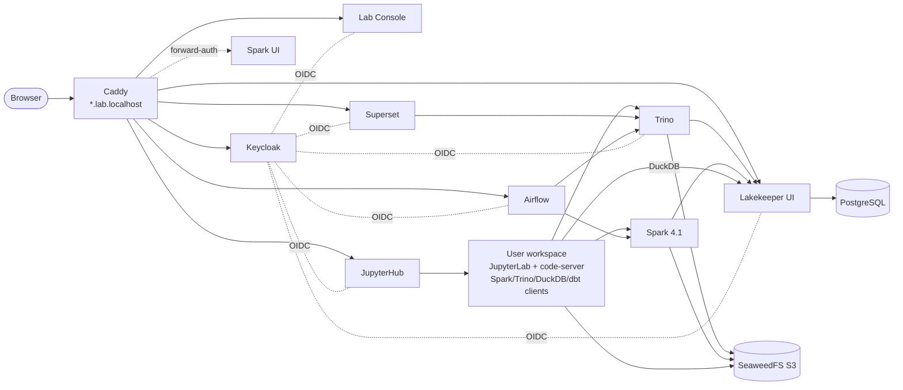
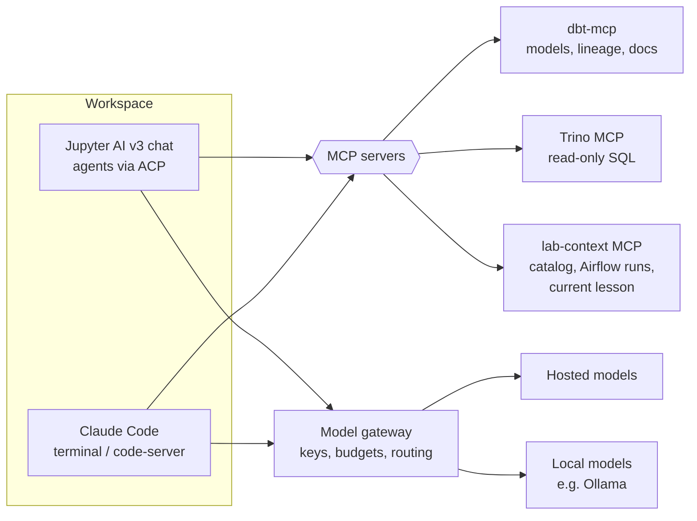

# V3 Architecture

> Draft · 2026-09-25 · Decisions referenced as ADR-nnn are in [DECISIONS.md](DECISIONS.md).

## 1. Component map

| Layer | Component | Role | ADR |
|---|---|---|---|
| Edge | **Caddy** | Reverse proxy, TLS, subdomain routing, forward-auth for tools without login | 004, 005 |
| Identity | **Keycloak** | Users, groups, OIDC clients for every service | 004 |
| Storage | **SeaweedFS** (S3 API) | Object storage for the lakehouse | 001 |
| Metadata | **Lakekeeper** | Iceberg REST catalog, storage-access vending, authorization | 002 |
| Metadata DB | **PostgreSQL** | Backing DB for Keycloak, Lakekeeper, Airflow, Superset (separate databases) | — |
| Compute | **Spark 4.1** (master + workers) | Batch/ETL engine for engineers and large jobs | 003 |
| Compute | **Trino** | Interactive SQL engine, the "SQL warehouse" for analysts and BI | 003 |
| Compute | **DuckDB** | Single-node engine inside workspaces | 003 |
| Transform | **dbt-core + dbt-trino** | SQL transformation layer, in every workspace | 008 |
| Orchestration | **Airflow 3.1+** | Scheduling DAGs, dbt runs, papermill notebooks | 009 |
| BI | **Superset 6.x** | SQL Lab and dashboards on Trino | 009 |
| Workspace | **JupyterHub** → JupyterLab + code-server per user | Main workspace for engineers | 007 |
| AI | **Jupyter AI v3**, Claude Code, MCP servers, model gateway | Assistants that know the lab's context | 014 |
| Home | **Lab Console** (static site) | Landing page, service health, learning tracks | 010 |
| Add-ons | Vizro, LanceDB, Portainer, Spark History | Optional modules | 011 |

## 2. Networking and hostnames (ADR-005)

- Every user-facing service gets its own subdomain under `LAB_DOMAIN`:
  `console.`, `auth.` (Keycloak), `jupyter.`, `superset.`, `airflow.`, `trino.`, `catalog.`,
  `spark.`, `storage.`.
- **Local default:** `LAB_DOMAIN=lab.localhost`. Browsers resolve `*.localhost` to loopback
  on their own. Containers reach services by compose service name, never through the
  public hostname.
- **Remote server:** `LAB_DOMAIN=<host-ip>.sslip.io` (no DNS setup) or a real wildcard DNS
  record. This replaces V2's four copies of host-IP detection: the installer detects the IP
  **once**, writes `LAB_DOMAIN`, and nothing else ever guesses.
- **TLS:** Caddy terminates TLS. On a public domain it gets ACME certificates automatically.
  On `lab.localhost`/`sslip.io` it uses its internal CA. The installer generates that root CA
  once and stores it outside any volume that upgrades can wipe. Remote users import it once,
  and the Console links to the file. Plain HTTP only works on `*.localhost`; on `sslip.io`
  it breaks OIDC (spike S-3, OQ-3).
- Caddy carries every public hostname as a Docker network alias, so containers resolve the
  same issuer URL as browsers.
- Only Caddy publishes host ports (80/443), plus Postgres/Trino client ports as an explicit
  opt-in.

## 3. Identity (ADR-004)

**Groups (Keycloak realm `lakehouse`):** `lab-admin`, `engineer`, `analyst`, `viewer`.
Each service maps these groups to its own roles.

| Service | Integration | Group mapping |
|---|---|---|
| JupyterHub | `GenericOAuthenticator` (OIDC) | `lab-admin` → hub admin; everyone else gets a workspace |
| Superset | FAB `AUTH_OAUTH` | admin → Admin, engineer/analyst → Alpha/Gamma+SQL Lab, viewer → Gamma |
| Airflow 3 | `apache-airflow-providers-keycloak` auth manager | Roles come from Keycloak Authorization Services (UMA permissions), set up by the bootstrap job; admin → Admin, engineer → Op/User, analyst/viewer → Viewer |
| Trino | OAuth2 for web UI; JWT for clients | Group-based access rules need a Trino group provider (`oauth2.groups-field` was removed in 483) |
| Lakekeeper | Native OIDC; authorization via OpenFGA or allow-all (OQ-5) | Group → namespace/warehouse permissions |
| Lab Console | OIDC login (PKCE, public client) | Shows only the tiles a user's groups can reach |
| Spark UI, SeaweedFS console | Caddy `forward_auth` to an OIDC proxy | admin/engineer only |

**Bootstrapping without clicks:** the installer brings up Keycloak and imports a realm
JSON (clients, groups, mappers, redirect URIs templated from `LAB_DOMAIN`), then creates
the first admin user with a generated password. `provision-user.sh` becomes a thin wrapper
around the Keycloak admin API. After this, no service stores its own users.

**External identity providers (ADR-016, optional):** Keycloak can hand logins to GitHub.
First-time GitHub users land in no group and wait for an admin to add them. Accounts are
never linked automatically by email, and a local admin always remains.

**Service-to-service:** Airflow, Superset and the workspaces reach Trino with the **user's**
token where the tool supports it, and otherwise with a per-service client-credentials
account. No service shares a long-lived password with another.

## 4. Data access (ADR-002, ADR-006)

- Every table is an **Iceberg** table registered in **Lakekeeper**. There is no
  "Iceberg overlay" and no path-based table access in lessons.
- Engines connect to the catalog with the caller's identity. Lakekeeper checks
  authorization and gives storage access:
  - **Remote signing** (SigV4) for Spark and PyIceberg.
  - **Vended STS credentials** for Trino and DuckDB, since neither supports remote signing.
    SeaweedFS issues them through AssumeRole with a per-table session policy set by
    Lakekeeper, and they last at most 1 hour. Spikes S-1 and S-2 confirmed this works on
    SeaweedFS 4.47 and that access is really limited to one table. SeaweedFS STS is therefore
    part of every profile.
- **No user ever sees an S3 key.** Static S3 credentials exist only for SeaweedFS admin,
  Lakekeeper's own storage profile, and backup. This removes the V2 regression class
  `REG_CREDENTIAL_PROPAGATION` structurally.
- Raw landing files (CSV/JSON/Parquet for ingestion lessons) live in a `landing` bucket that
  engineers can read through a scoped policy.

## 5. Workspace (ADR-007)

Each user gets a server from JupyterHub, built from one pre-built image `lakehouse-workspace`:

- JupyterLab with JupySQL (SQL cells against Trino/DuckDB), git extension, terminal
- **code-server** (VS Code in the browser) launched from JupyterLab via `jupyter-server-proxy`
- Pre-configured clients: PySpark 4.1 via **Spark Connect** (no JVM in the workspace; a
  classic-driver image variant is opt-in for Spark UI lessons), Trino Python client,
  DuckDB with the Iceberg extension, dbt-core + dbt-trino, PyIceberg. Every client is
  pre-pointed at the catalog with the user's identity.
- A starter dbt project and the learning-track content checked out into `~/lab`
- Per-user persistent volume for home; a shared read-only volume for course material

Single-user installs run the same JupyterHub with one user, so there is one code path
(V2 had two, `jupyter` and `jupyterhub`, which drifted apart).

## 6. Versions and images (ADR-012)

- `versions.env` is the **only** file that names a version. Compose, image builds, tests and
  docs read it. CI fails if a version literal appears anywhere else.
- A compatibility matrix is checked in CI: Spark minor ↔ Iceberg runtime
  (`iceberg-spark-runtime-4.1_2.13`) ↔ Scala 2.13 ↔ PySpark in the workspace.
- Custom images (`lakehouse-workspace`, `lakehouse-spark`, `lakehouse-airflow`,
  `lakehouse-superset`) are built in CI and published to GHCR, tagged with the V3 release.
  End users pull them and never build.

## 7. AI assist (ADR-014, proposed)

- **Context comes from MCP servers, independent of the assistant.** Existing servers are used
  first: the official dbt-mcp, and a Trino MCP server (to be evaluated). A thin
  `lab-context` server covers only the gaps: catalog browsing, Airflow run status, and the
  learner's current lesson. Any MCP-capable assistant gets the same context.
- **Surfaces:** Jupyter AI v3 chat in JupyterLab (agents over ACP, with an approval prompt
  before writes); Claude Code in the workspace terminal and code-server. Superset gets
  nothing in V3.0.
- **The assistant acts as the user.** MCP servers forward the user's Keycloak token, so the
  assistant sees only what the user can see. Read-only by default, with row and time
  limits on queries.
- **Model gateway:** the admin configures providers and keys once. Learners don't need keys.
  Per-user budgets. Local models can be used for private data or offline labs.
- **Tutor mode:** inside learning tracks, the assistant is instructed to explain and hint
  rather than write solutions. Outside tracks it acts as a normal pair-programmer. Users
  can turn it off.

## 8. Profiles and resources

| Profile | Services | Target RAM |
|---|---|---|
| `core` | Caddy, Keycloak, Postgres, SeaweedFS, Lakekeeper, Trino, JupyterHub (1–2 users), Console | ~12 GB of limits; idle use measured at ~3 GB (spikes). Load test still needed (OQ-4) |
| `engineer` | core + Spark master/worker + Airflow | ~20 GB |
| `full` | engineer + Superset + AI gateway | ~24 GB |
| `server` | full, with bigger Spark worker and Trino memory for multi-TB work | 64 GB+ |
| add-ons | Vizro, LanceDB, Portainer, Spark History, local LLM | per module |

Profiles are Compose `profiles:`, selected by the installer. They replace V2's generated
`docker-compose.override.yml`.

## 9. What V3 removes from V2

- MinIO, the MinIO init container, and bucket creation from shell scripts
- The `lakehouse-init` one-shot container that installs things at runtime (replaced by
  images plus a small idempotent `bootstrap` job: Keycloak realm import, catalog warehouse
  creation, sample-data load)
- Inline bash in compose `command:` blocks
- Per-service credential generation and display (Keycloak + vending replace them)
- Host-IP detection in multiple scripts
- The separate `jupyter` vs `jupyterhub` modes
- The generated compose override (replaced by profiles)
